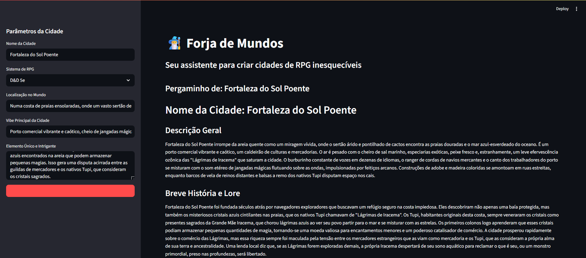

# Forja de Mundos - Gerador de Cenários de RPG


Uma aplicação web construída com Python, Streamlit e a API do Google Gemini para gerar cenários de cidades detalhadas para diversas campanhas de RPG, ajudando Mestres de Jogo a superar o bloqueio criativo.

---

### 📸 Demonstração

*(Substitua esta linha por um printscreen ou GIF da sua aplicação rodando)*


---

### Sobre o Projeto

Como Mestre de RPG, sei que uma das tarefas mais demoradas e desafiadoras é a criação de cenários vibrantes e cheios de vida. A "Forja de Mundos" nasceu para resolver esse problema. Esta ferramenta utiliza o poder da Inteligência Artificial Generativa (através da API Gemini do Google) para construir a fundação de uma cidade em segundos.

Basta fornecer alguns parâmetros criativos, e a IA irá gerar uma descrição completa, incluindo história, locais notáveis e ganchos de aventura, tudo formatado e pronto para ser usado na sua próxima sessão de jogo.

---

### 🧠 O Problema e a Solução

**O Desafio:** Criar cidades para campanhas de RPG exige tempo. É preciso pensar em economia, política, geografia, NPCs e ganchos de aventura que façam sentido juntos. Muitas vezes, o Mestre sofre com o "bloqueio criativo" ou falta de tempo de preparação.

**A Solução:** Uma ferramenta que atua como um "Co-Piloto Criativo". Ao invés de tabelas aleatórias genéricas, a Forja de Mundos usa a API do **Google Gemini** com engenharia de prompt avançada para conectar os pontos. Se você pede uma "Cidade no deserto feita de vidro", a IA entende as implicações lógicas disso e gera facções e rumores coerentes.

---

### Features

* **Geração de Cidades Detalhadas:** Cria descrições, história, governo, locais notáveis e ganchos de aventura.
* **Adaptação a Sistemas:** O conteúdo gerado se adapta a diferentes sistemas de RPG (D&D 5e, Tormenta20, etc.), usando conceitos e termos relevantes.
* **Interface Web Interativa:** Construído com Streamlit para uma experiência de usuário amigável e intuitiva.
* **Gestão Eficiente de Recursos:** Utiliza o cache do Streamlit (@st.cache_resource) para carregar e configurar o modelo de IA apenas uma vez, garantindo performance fluida sem reconexões desnecessárias.
* **Exportação de Cenários:** Permite baixar o background da cidade gerada em formato Markdown (`.md`) com um único clique.
* **Conteinerizado com Docker:** O projeto é totalmente conteinerizado, garantindo um setup e execução consistentes em qualquer máquina com o Docker instalado.
* **Orquestração Simplificada:** Utiliza `docker-compose` para que a aplicação possa ser iniciada com um único comando (`docker-compose up`).

---

### Tecnologias Utilizadas

* **Backend:** Python
* **Interface Web:** Streamlit
* **Inteligência Artificial:** Google Gemini API
* **Conteinerização:** Docker & Docker Compose
* **Gerenciamento de Ambiente:** python-dotenv

---

### Como Executar o Projeto

Para rodar este projeto localmente, você precisará ter o **Git** e o **Docker Desktop** instalados.

1.  **Clone o repositório:**
    ```bash
    git clone https://github.com/CarlosFranchN/Forja-de-Cidades-RPG.git
    cd https://github.com/CarlosFranchN/Forja-de-Cidades-RPG.git
    ```

2.  **Configure suas credenciais:**
    Crie uma cópia do arquivo `.env.example` (ou crie um novo arquivo) e renomeie para `.env`. Em seguida, adicione sua chave da API do Google.
    ```
    # .env
    GOOGLE_API_KEY="SUA_CHAVE_SUPER_SECRETA_AQUI"
    ```

3.  **Inicie a aplicação com Docker Compose:**
    Este comando irá construir a imagem Docker (na primeira vez) e iniciar o contêiner da aplicação.
    ```bash
    docker-compose up
    ```

4.  **Acesse a aplicação:**
    Abra seu navegador e acesse `http://localhost:8501`.

---

### Execução Manual (Python Tradicional)

Caso prefira rodar diretamente no seu ambiente Python (sem Docker), siga estes passos:

1.  **Crie e ative um ambiente virtual:**
    ```bash
    # Windows
    python -m venv venv
    .\venv\Scripts\activate

    # Linux/Mac
    python3 -m venv venv
    source venv/bin/activate
    ```

2.  **Instale as dependências do projeto:**
    ```bash
    pip install -r requirements.txt
    ```

3.  **Configure a API Key:**
    Certifique-se de ter criado o arquivo `.env` na raiz do projeto com sua chave:
    `GOOGLE_API_KEY="sua_chave_aqui"`

4.  **Inicie a aplicação:**
    ```bash
    streamlit run app.py
    ```
### Estrutura do Projeto

```
├── ⚙️ .gitignore
├── 🐳 Dockerfile
├── 📝 README.md
├── 🐍 app.py
├── 🐍 assistente_mestre.py
├── ⚙️ docker-compose.yml
├── 📄 requirements.txt
└── 🐍 teste_models.py
```

---

### Próximos Passos e Melhorias

* [ ] Geração de NPCs: Criar fichas de personagens completas baseadas na cidade.
* [ ] Integração de Imagem: Usar IA para gerar o brasão ou mapa da cidade.
* [ ] Integração com uma API de geração de imagens para criar um "retrato" da cidade.
* Deploy: Hospedar no Streamlit Community Cloud.

---


📝 Licença

Desenvolvido por Carlos Franch - [Conecte-se](https://www.linkedin.com/in/carlos-neto-91191723a/)